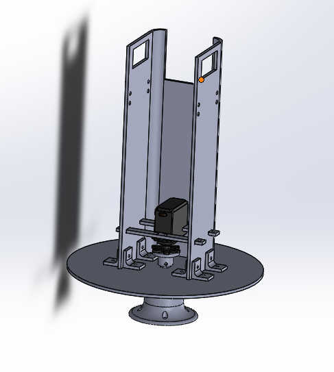
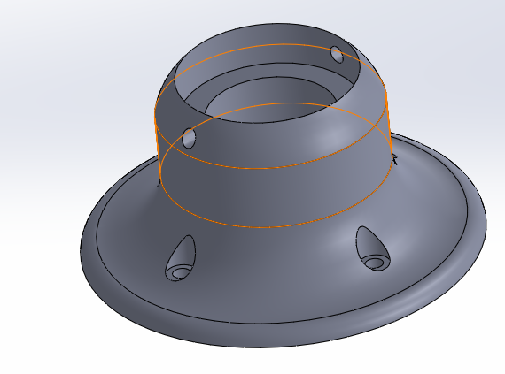
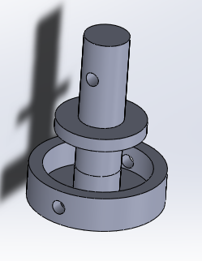
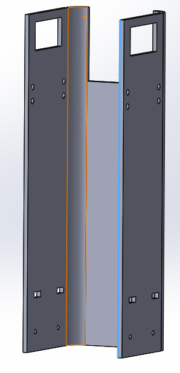
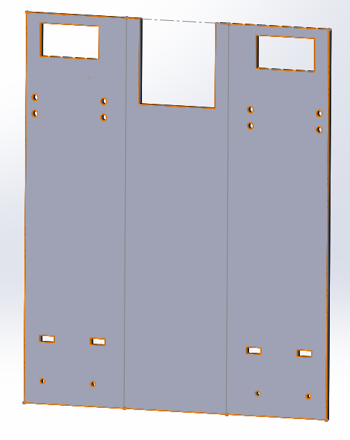
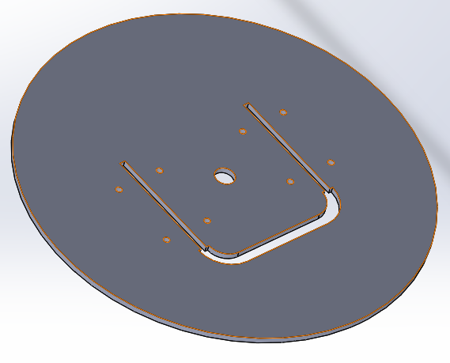

# RobotArm
#### CHS Engineering 3 Robot Arm Project, By: Camden Baucom and Philip Breen

During this project, we aspired to create a fun and fucntional mechanism controlled with servos and a GUI, a graphical user interface. While researching past Robot Arm projects in the Sigma Lab, we were dissapointed to see how similar and seemingly useless they were, so we decided to move in a completely new and more interesting direction, a Nerf Blaster. We decided to place "**The Blaster**" on a rotating base situated on a bearing which would be controlled by a servo. Then, the vertical positing of "**The Blaster**" would be controlled by two servos that elevate the device above the base. All three of these servos would be controlled by the GUI, allowing us to have a wide range of movement for "**The Blaster**", all while never laying a finger on it. The reving system would be controlled by mounting a relay to the elctronic components inside "**The Blaster**." Finally, the trigger mechanism would be controlled by mounting a simple servo to the device's already established firing components.

### Plan


### Schedule
* Jan. 9 - Finish initial planning ✔
* Jan. 13 - Complete GUI ✔
* Jan. 20 - Finish CAD for rotating base ✔
* Jan. 27 - Code working for servo rotation ✔
* Feb. 3 - Trigger assembled (Took a little longer than expected) ✔
* Feb. 10 - GUI controls trigger ✔
* Feb. 17 - Most CAD done ✔
* Feb. 24 - All code done: trigger, rev, rotation ✔
* Mar. 2 - All CAD done ✔
* Mar. 9 - Cut and print all parts ✔
* Mar. 16 - Finish bending the Servo Holder and most other assemblies ✔
* Mar. 23 - Finish Assembly ❌ (Inschool Class Canceled)
* Mar. 30 - CAD testing and improvements ❌ (Inschool Class Canceled)
* Apr. 6 - Code testing and improvements ❌ (Inschool Class Canceled)
* Apr. 13 - Finish ❌ (Inschool Class Canceled)

### CAD Componets



The "pitch" of this part is based on two servos attached to either side of "**The Blaster**." The "yaw" of this part is based on the bearing inside the servo. This physical component of this piece is made up of two parts: first an immboile part, a solid bottom base connects to the central shaft which connects to the "horn" of the servo, and second a rotating part, the rest of the servo spins which also spins the Servo Holder, as they are connected, as well as the plate. 

##### Base



##### Central Shaft



##### Servo Holder




##### Plate




### Software Planning

Software should be able to take inputs from processing GUI and use CircuitPython to execute.

#### Needed Logic:
```
Tab Pulls Trigger

Enter enabled Rev

Trigger only pulled if Rev is enabled for 2+ seconds

Use x and y axis in GUI to adjust position


```


### Software developement


```
Give the example
```


```
until finished
```


## Running the tests


### Break down into end to end tests


```
Give an example
```

### And coding style tests


```
Give an example
```

## Deployment


## Built With

* Processing v3
* CircuitPython [Metro Board]
* SolidWorks 

## Authors

* **Camden Baucom** - *Build, CAD, and wiring* 
* **Philip Breen** - *Head of code and design* 

## Acknowledgments


